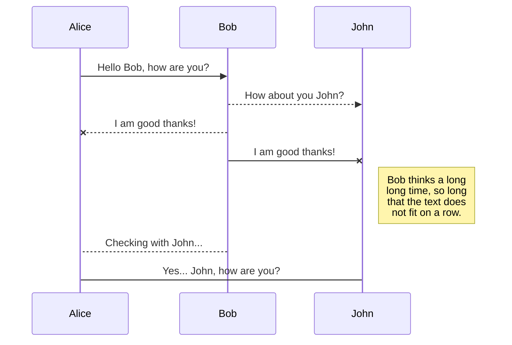
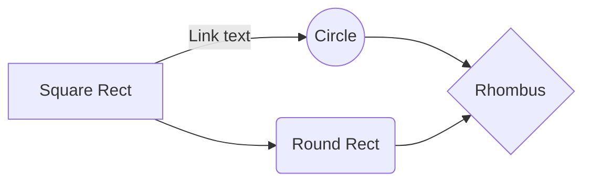

# NGS Quality Control Tutorial: Understanding QC
This tutorial is intended to understand basic NGS statistics (mainly obtained with FastQC), and some of the steps required to  fix or ameliorate some of the issues. Most of the information of this tutorial have been partially taken from the FastQC documentation available [here](https://www.bioinformatics.babraham.ac.uk/projects/fastqc/Help/3%20Analysis%20Modules/).

### Objectives / learning outcomes:

At the end of this tutorial you shoud be able to:

1. Understand the QC statistics used in FASTQC
2. Identify problems in NGS datasets
3. Remove adapters and primers 
4. Make simple quality trimming for reads

This tutorial assumes that you have a basic knowledge in bash, and that you have an account and know how to connect to the Compute Canada clusters. If you dont, I reccomend you go over the [BASH tutorial](https://github.com/jshleap/CristescuLab_misc/blob/master/Tutorials/Bash/Bash_Tutorial.ipynb) and you read the [Compute Canada documentation](https://docs.computecanada.ca/wiki/Compute_Canada_Documentation).

### Outline of the tutorial
1. [To start: A couple of things we need before we start the tutorial](#to-start)
2. [Getting the statistics with fastqc](#getting-the-statistics-with-fastqc)
3. [Basic Statistics](#basic-statistics)
4. [Per Base Sequence Quality](#per-base-sequence-quality)
5. [Per tile sequence quality](#per-tile-sequence-quality)
6. [Per sequence quality scores](#per-sequence-quality-scores)
7. [Per base sequence content](#per-base-sequence-content)

## To start

To start, let's download [this file](https://github.com/jshleap/CristescuLab_misc/raw/master/Tutorials/NGS_QC/files/file1_R1.fastq.gz) to your account in Compute Canada. Also, load the following modules fastqc:

```
module load fastqc/0.11.5
module load trimmomatic/0.36
```

## Getting the statistics with fastqc

The statitics of any fastq file is easily obtained by the fastqc program. This program inludes a set of statistical test and modules to test for quality. From their README file:

> FastQC is an application which takes a FastQ file and runs a series
of tests on it to generate a comprehensive QC report.  This will
tell you if there is anything unusual about your sequence.  Each
test is flagged as a pass, warning or fail depending on how far it
departs from what you'd expect from a normal large dataset with no
significant biases.  It's important to stress that warnings or even
failures do not necessarily mean that there is a problem with your
data, only that it is unusual.  It is possible that the biological
nature of your sample means that you would expect this particular
bias in your results.

So let's run it!:

`fastqc file1_R1.fastq.gz`

This must have created an html file as well as a zipped folder. Use `rsync`, `scp`, [FileZilla](https://filezilla-project.org/), or your favorite file transfer protocol to get the html to your own computer, and open it in a browser.

## Basic Statistics

This table will give you basic information about your reads:
1. **Filename**: The name of the file being analyzed
2. **File type**: The type of information the file contains
3. **Encoding**: How are the quality scores encoded
4. **Total Sequences**: umber of reads in your file
5. **Sequences flagged as poor quality**: Number of sequences with very low quality thoughout
6. **Sequence length**: Average sequence length
7. **%GC**: Percentage of GC content

For our file we get:


### Encoding
Encoding is the way the quality of the bases are written. There are many encodings, but the most popular are Sanger, Solexa, Ilumina 1.3+, Illumina 1.5+, and illumina 1.8+.  In summary, is a character that represents the confidence you have in a given base call.

For more information check https://en.wikipedia.org/wiki/FASTQ_format#Encoding

But what does a quality score means? It s related to the probability of an error:
|Phred Quality Score |Probability of incorrect base call|Base call accuracy|
|--- |--- |--- |
|10|1 in 10|90%|
|20|1 in 100|99%|
|30|1 in 1000|99.9%|
|40|1 in 10,000|99.99%|
|50|1 in 100,000|99.999%|
|60|1 in 1,000,000|99.9999%|

As a rule of thumb a Phred score above 20 (99% chances to be right) is considered acceptable and above 30 (99.9% chances to be right) as good.

I am not going to enter the rest of the basic statistics since they are self-explanatory.

## Per Base Sequence Quality

It's name is self explanatory. This module evaluates the quality at each base for all reads. FastQC gives you a box plot of the qualities, representing the inter-quartile range (25-75%) (yellow box), the extremes 10 and 90th percentiles are represented by the whiskers, the median value by a red line, and the mean quality by the blue line.


From the documentation of this module:

> #### Warning 
> A warning will be issued if the lower quartile for any base is less than 10, or if the median for any base is less than 25.
> #### Failure
> This module will raise a failure if the lower quartile for any base is less than 5 or if the median for any base is less than 20.

#### *Look at the figure above. What do you think is happening at the end? why?*

## Per tile sequence quality
This a feature that is exclusive to Illumina technologies. Their flow cells typically have 8 lanes,with 2 columns and 50 tiles:


Courtesy of http://zjuwhw.github.io/2016/08/13/Illumina_sequencer.html

When systematic error occur in a tile, it can indicate sequencing error such as bubbles, smudges, or dirt. When the errors occur very sparsely and not too widespread, is often OK to overlook this error. When a full lane has a problem, oftentimes is a sequencing error and this cannot be fixed with bioinformatics. The problem can occur as as well when the flowcell is overloaded.
In our case we have:


Not the best quality, but there is no systematic bias... we might be able to fix this with some quality trimming.

From FastQC documentation:
> #### Warning
> This module will issue a warning if any tile shows a mean Phred score more than 2 less than the mean for that base across all tiles.
> #### Failure
> This module will issue a warning if any tile shows a mean Phred score more than 5 less than the mean for that base across all tiles.

## Per sequence quality scores

This module allows you to explore if a significant portion of your reads are of poor quality. Often times warnings occur when your sequence is shorter than your read length, and therefore the end of reads (or the end of the flowcell) is of poor quality.
This is the case for our File1:


This warning can therefore be dealt with some tail-trimming.
From FastQC documentation:
>#### Warning
>A warning is raised if the most frequently observed mean quality is below 27 - this equates to a 0.2% error rate.
>#### Failure
>An error is raised if the most frequently observed mean quality is below 20 - this equates to a 1% error rate.

## Per base sequence content


# Synchronization

Synchronization is one of the biggest features of StackEdit. It enables you to synchronize any file in your workspace with other files stored in your **Google Drive**, your **Dropbox** and your **GitHub** accounts. This allows you to keep writing on other devices, collaborate with people you share the file with, integrate easily into your workflow... The synchronization mechanism takes place every minute in the background, downloading, merging, and uploading file modifications.

There are two types of synchronization and they can complement each other:

- The workspace synchronization will sync all your files, folders and settings automatically. This will allow you to fetch your workspace on any other device.
	> To start syncing your workspace, just sign in with Google in the menu.

- The file synchronization will keep one file of the workspace synced with one or multiple files in **Google Drive**, **Dropbox** or **GitHub**.
	> Before starting to sync files, you must link an account in the **Synchronize** sub-menu.

## Open a file

You can open a file from **Google Drive**, **Dropbox** or **GitHub** by opening the **Synchronize** sub-menu and clicking **Open from**. Once opened in the workspace, any modification in the file will be automatically synced.

## Save a file

You can save any file of the workspace to **Google Drive**, **Dropbox** or **GitHub** by opening the **Synchronize** sub-menu and clicking **Save on**. Even if a file in the workspace is already synced, you can save it to another location. StackEdit can sync one file with multiple locations and accounts.

## Synchronize a file

Once your file is linked to a synchronized location, StackEdit will periodically synchronize it by downloading/uploading any modification. A merge will be performed if necessary and conflicts will be resolved.

If you just have modified your file and you want to force syncing, click the **Synchronize now** button in the navigation bar.

> **Note:** The **Synchronize now** button is disabled if you have no file to synchronize.

## Manage file synchronization

Since one file can be synced with multiple locations, you can list and manage synchronized locations by clicking **File synchronization** in the **Synchronize** sub-menu. This allows you to list and remove synchronized locations that are linked to your file.


# Publication

Publishing in StackEdit makes it simple for you to publish online your files. Once you're happy with a file, you can publish it to different hosting platforms like **Blogger**, **Dropbox**, **Gist**, **GitHub**, **Google Drive**, **WordPress** and **Zendesk**. With [Handlebars templates](http://handlebarsjs.com/), you have full control over what you export.

> Before starting to publish, you must link an account in the **Publish** sub-menu.

## Publish a File

You can publish your file by opening the **Publish** sub-menu and by clicking **Publish to**. For some locations, you can choose between the following formats:

- Markdown: publish the Markdown text on a website that can interpret it (**GitHub** for instance),
- HTML: publish the file converted to HTML via a Handlebars template (on a blog for example).

## Update a publication

After publishing, StackEdit keeps your file linked to that publication which makes it easy for you to re-publish it. Once you have modified your file and you want to update your publication, click on the **Publish now** button in the navigation bar.

> **Note:** The **Publish now** button is disabled if your file has not been published yet.

## Manage file publication

Since one file can be published to multiple locations, you can list and manage publish locations by clicking **File publication** in the **Publish** sub-menu. This allows you to list and remove publication locations that are linked to your file.


# Markdown extensions

StackEdit extends the standard Markdown syntax by adding extra **Markdown extensions**, providing you with some nice features.

> **ProTip:** You can disable any **Markdown extension** in the **File properties** dialog.


## SmartyPants

SmartyPants converts ASCII punctuation characters into "smart" typographic punctuation HTML entities. For example:

|                |ASCII                          |HTML                         |
|----------------|-------------------------------|-----------------------------|
|Single backticks|`'Isn't this fun?'`            |'Isn't this fun?'            |
|Quotes          |`"Isn't this fun?"`            |"Isn't this fun?"            |
|Dashes          |`-- is en-dash, --- is em-dash`|-- is en-dash, --- is em-dash|


## KaTeX

You can render LaTeX mathematical expressions using [KaTeX](https://khan.github.io/KaTeX/):

The *Gamma function* satisfying $\Gamma(n) = (n-1)!\quad\forall n\in\mathbb N$ is via the Euler integral

$$
\Gamma(z) = \int_0^\infty t^{z-1}e^{-t}dt\,.
$$

> You can find more information about **LaTeX** mathematical expressions [here](http://meta.math.stackexchange.com/questions/5020/mathjax-basic-tutorial-and-quick-reference).


## UML diagrams

You can render UML diagrams using [Mermaid](https://mermaidjs.github.io/). For example, this will produce a sequence diagram:



And this will produce a flow chart:


<!--stackedit_data:
eyJoaXN0b3J5IjpbMTM2NzU4MjI2MiwtMTUyNzc2MDc3MCwxMj
MxMTU2NTY5LDE2ODc5MDc1MjUsLTQwNTkyMjMzMiwtMTgxNzk2
Mzk3NCwtMTIzMjAzNzAxNSwxNTc2Mjc2NjYzLDg0NzMxNTM1Ni
wtMTEzOTI2NDUxNCwxNTE2MDcyMzc4LDE1MzI0MDgwOTYsLTQ3
NjY0Nzg1Niw5MDU5MzgzMzEsMTg4OTQ2NjM5MSwxMjExODEwMj
csLTIwNDA2MDM4NzAsLTE1Mjg2NjY0MzAsLTIyOTE4ODM1NF19

-->